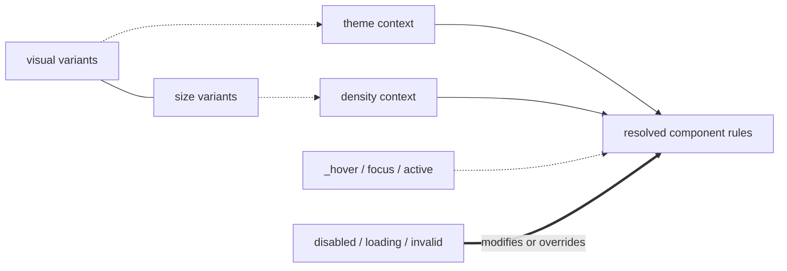

# Component Axes Graph

Mermaid показывает слои, но не полное 3D-пространство возможных сочетаний.

Связь между variants означает одну базовую component combination, а не заранее сгенерированную сущность. System contexts уточняют соответствующие properties; interaction conditions действуют property-local; behavior states меняют только применимые rules или перекрывают interaction response.
